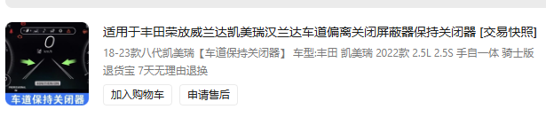

# Disable annoying driver aids
Driver aids nannying bullshit drives me crazy. However, in the XV70 Camry, they can be kept down to a minimum

## Front & rear assists (PCS & RCTA in Toyota terminology)
PCS never misses a chance to get you rear ended in Vietnamese traffic, and RCTA makes turning the car nigh
impossible. These monstrosities default to turning themselves on at every start, but Toyota Techstream
(if you can get your hands on it) or the Carista app over any generic ELM327 OBD Bluetooth/Wi-Fi adapters
can force the car to remember their on/off states, so they can be turned off once and for all

## Lane keep assist (LDA/LTA in Toyota terminology)
Not possible to code this to remember its last state, but you can buy a wiring harness that plugs into the
steering wheel harness to disable it by default at every start. I got mine from Taobao

