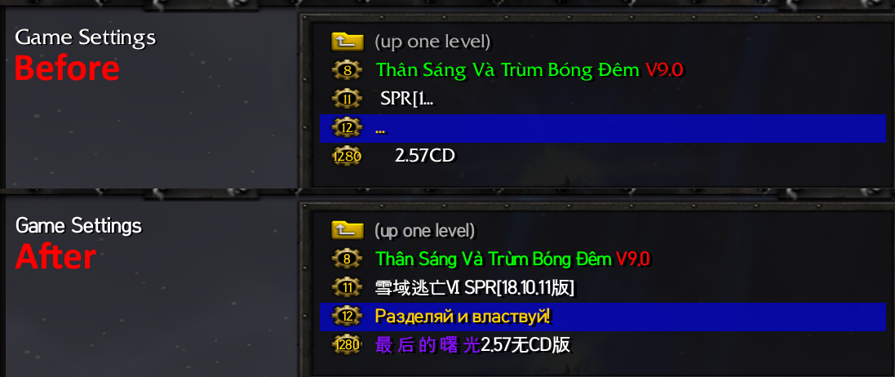

# Change default UI font (WC3 1.29.2 and below)
Classic Warcraft III's default Friz Quadrata TT font does not support Unicode characters, so
map names with them do not show up properly. We are gonna change a registry key to tell WC3
to load external fonts

!!! warning
    Only applicable to WC3 version 1.29.2 and below



* Save the following code block as a `.reg` registry key and import it
``` registry
Windows Registry Editor Version 5.00

[HKEY_CURRENT_USER\Software\Blizzard Entertainment\Warcraft III]
"Allow Local Files"="dword:00000001"
```
* Make a folder named `Fonts` in your WC3 folder

* Copy whatever Unicode font you want to replace the default UI font with into `Fonts`.
I use HCR Dotum Bold personally

* Rename the font file to `FRIZQT__.ttf`

!!! tip "Replace chat fonts"

    WC3 uses different fonts for different chat support settings in-game. I cannot remember which
    one is used for what support, but their names are:

    * `dffn_b31.ttf`

    * `DFHeiMd.ttf`

    * `dfst-m3u.ttf`

    * `NIM_____.ttf`

    * `tt5500m_.ttf`

    Replace them if you need to using the same method above